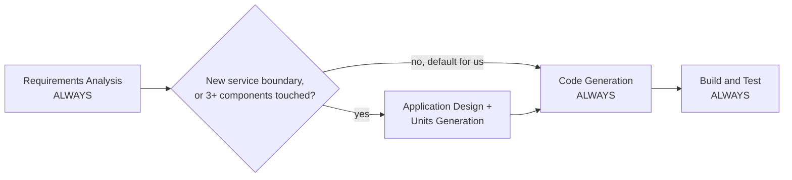
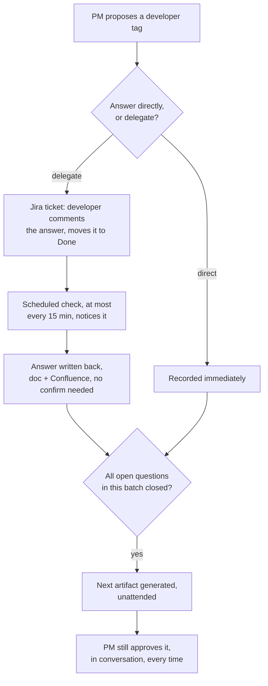

# AIT PM — Custom AIDLC

A Product-Manager-orchestrated, adaptive development process, customized on top of the AI-Driven Development Life Cycle (AIDLC) framework. Open this repo in Claude Code and the process below runs automatically — there's nothing to install beyond what's in [Setup](#setup).

What's customized here, versus a stock AIDLC install:

- **A PM Orchestrator persona** — one AI, playing a 15+-year enterprise PM, drives every stage. No spawned sub-agents.
- **Startup-calibrated stage gates** — conditional design/NFR stages default to skip unless a change actually crosses a service boundary, touches 3+ components, or involves auth/payments/PII/new infrastructure.
- **A mandatory, lightweight engineering-standards extension** — reversible rollout, test coverage, no hardcoded secrets, breaking changes called out — enforced on every project, no opt-in needed.
- **Developer-tagged Jira tickets, with a closed loop** — a delegated question's answer comes back from Jira automatically; no one has to babysit it.
- **Confluence publishing** — real API writes when your connector supports them, a REST fallback when it doesn't, always with your confirmation before anything new goes out.

## Contents

- [Setup](#setup)
- [How the process works](#how-the-process-works)
- [Extensions](#extensions)
- [Developer tagging, Jira, and the answer loop](#developer-tagging-jira-and-the-answer-loop)
- [Publishing to Confluence](#publishing-to-confluence)
- [Repository structure](#repository-structure)
- [FAQ](#faq)
- [Customizing this further](#customizing-this-further)

## Setup

This repo is **private** — ask the owner to add you as a collaborator before cloning.

### Option A — starting a brand-new project

```bash
git clone https://github.com/jeevanjoy-ait/AIT-PM.git my-project
cd my-project
git remote set-url origin <your-new-project-repo-url>   # point it at your own repo, not this one
```

Open the folder in Claude Code and describe what you want to build. Application code goes at the workspace root; everything AIDLC generates lands in `aidlc-docs/`.

### Option B — adding this to an existing project

Copy two things into the root of your existing repo:

```bash
cp -r AIT-PM/.aidlc-rule-details  your-existing-project/
cp AIT-PM/CLAUDE.md               your-existing-project/     # merge by hand if you already have one
```

If your project already has a `CLAUDE.md`, merge the two rather than overwriting — this workflow needs to be the first thing your `CLAUDE.md` tells the AI to do (see the "PRIORITY" note at the top of [`CLAUDE.md`](CLAUDE.md)).

### One-time setup, per developer

- [ ] Clone (or copy in) the repo, open Claude Code in it.
- [ ] Authorize the **Atlassian connector** for your own account (claude.ai connector settings, or `/mcp`) if this project will use Jira or Confluence.
- [ ] Fill in `aidlc-docs/team-roster.md` with real developers — name, Jira email, skill tags. It's created automatically from [the template](.aidlc-rule-details/common/team-roster-template.md) the first time it's needed; the PM won't invent names to fill gaps.
- [ ] Optional — authorize the **Slack connector** if you want approval gates echoed to a channel.
- [ ] Optional, only if your Confluence connector turns out to be read-only (the workflow checks and tells you): set `CONFLUENCE_BASE_URL`, `CONFLUENCE_EMAIL`, `CONFLUENCE_API_TOKEN`, `CONFLUENCE_SPACE_KEY` locally. Details in [`integration-setup.md`](.aidlc-rule-details/common/integration-setup.md).

That's it. The first message you send about building something triggers the welcome message, the PM persona introducing itself, and the workflow below.

## How the process works

Four stages always run: Requirements Analysis, Workflow Planning, Code Generation, and Build & Test. Everything else is conditional — and, for us, calibrated to skip by default unless the change is genuinely significant (see [`org-profile.md`](.aidlc-rule-details/common/org-profile.md)).



**Text alternative:**
- Requirements Analysis — always runs
- Decision: does this introduce a new service boundary, or touch 3+ components?
  - **No (our default)** — skip straight to Code Generation
  - **Yes** — run Application Design + Units Generation first, then Code Generation
- Build and Test — always runs

The same threshold governs NFR Requirements / NFR Design / Infrastructure Design (auth, payments, PII, or new infrastructure trigger them) and User Stories (customer-facing work or multiple personas trigger it). **None of this removes an approval gate** — it only changes what gets *proposed* as execute vs. skip. You can always force a skipped stage open at the Workflow Planning approval gate.

Who's actually running this: [`pm-orchestrator-persona.md`](.aidlc-rule-details/common/pm-orchestrator-persona.md) — one persona, no spawned agents, judgment defaults toward moving fast except on auth, payments, PII, or production data.

## Extensions

One of these is always on. The rest are questions the PM asks during Requirements Analysis — answer once per project, not once per requirement.

| Extension | Type | What it does | Our default |
|---|---|---|---|
| [Engineering Standards](.aidlc-rule-details/extensions/org/engineering-standards/engineering-standards.md) | Mandatory | Reversible rollout for Medium+ risk changes, tests for new logic, no hardcoded secrets, breaking changes called out before code is written. | Always enforced, no question asked. |
| [Security Baseline](.aidlc-rule-details/extensions/security/baseline/security-baseline.md) | Opt-in | 15 blocking rules — encryption, access control, input validation, auth, supply chain, and more. | **Yes**, even pre-launch. Three rules (SBOM, CI/CD integrity, alerting dashboards) can be marked N/A pre-production. |
| [Resiliency Baseline](.aidlc-rule-details/extensions/resiliency/baseline/resiliency-baseline.md) | Opt-in | Fault tolerance and recovery patterns. | **No** for now — revisit once there's production traffic and an on-call rotation. |
| [Property-Based Testing](.aidlc-rule-details/extensions/testing/property-based/property-based-testing.md) | Opt-in | Generative test cases for complex logic. | **No** by default — opt in per-module for genuinely complex algorithmic or parsing code. |
| [Jira / Confluence Sync](.aidlc-rule-details/extensions/integrations/tracking/jira-confluence-sync.md) | Opt-in | Developer-tagged tickets, delegated answers flowing back automatically, every artifact mirrored to Confluence. | On for anything a stakeholder outside the repo needs visibility into. |
| [Slack Gate Notifications](.aidlc-rule-details/extensions/integrations/notifications/slack-gate-notify.md) | Opt-in | Posts a heads-up to a channel whenever a stage is waiting on approval — never replaces the approval itself. | On for teams reviewing async. |

## Developer tagging, Jira, and the answer loop

Every requirement — and every clarifying question while requirements are still being drafted — carries a tag naming who's expected to own it. It's a proposal until a human signs off, never a silent assignment.

- **Answer a question directly** — fill in `[Answer]:` yourself, the way this has always worked. Resolved immediately, no Jira involved.
- **Delegate it instead** — leave `[Answer]:` blank and confirm the `[Proposed Developer]:` tag. A Jira ticket goes to them with instructions to comment their answer and move it to Done.



**Text alternative:** tag proposed → human answers directly (resolved immediately) or delegates (Jira ticket → developer resolves → scheduled check within ~15 min notices it → answer synced back to docs + Confluence without a confirmation step) → once every open question in the batch is closed, either way → next artifact generated unattended → **the PM still has to approve it in conversation**. A resolved ticket unblocks a question; it never approves a deliverable.

Full mechanics: [`jira-confluence-sync.md`](.aidlc-rule-details/extensions/integrations/tracking/jira-confluence-sync.md).

## Publishing to Confluence

Every markdown artifact under `aidlc-docs/inception/`, `construction/`, and `operations/` gets mirrored to Confluence as it's created, matching the folder structure as a page tree. How the write actually happens is detected, not assumed:

1. The workflow probes your Atlassian connector for Confluence write tools.
2. **Found** → uses them directly, nothing to configure.
3. **Not found** → asks you to choose: fix the connector's scopes, or use a REST API fallback (needs `CONFLUENCE_BASE_URL` / `CONFLUENCE_EMAIL` / `CONFLUENCE_API_TOKEN` / `CONFLUENCE_SPACE_KEY` set locally — see [`integration-setup.md`](.aidlc-rule-details/common/integration-setup.md)).

You're asked before every single page goes up — one exception: a delegated question's answer flowing back from Jira publishes without asking, since the developer's own resolution of the ticket is the approval for that content. Nothing else skips it. Mermaid diagrams don't render in Confluence, so they're published as a labeled code block pointing back to the repo instead.

## Repository structure

```text
CLAUDE.md                                     loads everything below, plus phase logic
.aidlc-rule-details/
├── common/
│   ├── org-profile.md                        stage-trigger calibration, extension defaults
│   ├── pm-orchestrator-persona.md            the PM's persona and judgment defaults
│   ├── team-roster-template.md               copied to aidlc-docs/team-roster.md on first use
│   └── integration-setup.md                  what to configure once per machine
└── extensions/
    ├── org/engineering-standards/            mandatory, always on
    └── integrations/
        ├── tracking/jira-confluence-sync.*    Jira tagging + answer loop + Confluence publishing
        └── notifications/slack-gate-notify.*  Slack gate pings

aidlc-docs/                                    generated per project, committed to the repo
├── team-roster.md                             real names, emails, skills — fill this in
├── inception/ · construction/ · operations/   every artifact AIDLC produces
├── aidlc-state.md                             progress + integration config, not published
└── audit.md                                   full interaction log, not published
```

## FAQ

**Why does Application Design keep getting skipped on things that feel important?**
The bar is "new service boundary, ≥3 components, or you explicitly ask for it" — not "feels important." Ask for it at the Workflow Planning gate if you want the review anyway; it's never closed off.

**What if the PM tags the wrong developer?**
Edit the `[Assigned Developer]:` line before you approve the requirements doc — that's the checkpoint by design. After a Jira ticket exists, reassign it in Jira like any other ticket.

**Does resolving a Jira ticket ever count as approving a document?**
No, never. It only closes out the specific question the ticket was opened for. Every finished artifact still gets reviewed and approved by a human in the conversation.

**How long does an answer actually take to show up?**
Up to ~15 minutes for delegated questions — that's the scheduled check's default cadence, configurable the first time you delegate one. Direct answers are instant.

**Do I have to turn on Jira, Confluence, or Slack?**
No. Every integration is opt-in, asked once per project during Requirements Analysis. Say no and everything stays local markdown in `aidlc-docs/`.

**Where do I see what got skipped, and why?**
`aidlc-docs/inception/plans/execution-plan.md` lists every stage with its EXECUTE/SKIP call and reasoning; `aidlc-docs/audit.md` has the full timestamped log of every approval.

## Customizing this further

Everything above is additive on top of the stock AIDLC rule files — the base framework files weren't edited directly, so pulling in upstream AIDLC updates shouldn't conflict with what's here.

- To add a new **mandatory** rule set: follow the pattern in [`engineering-standards.md`](.aidlc-rule-details/extensions/org/engineering-standards/engineering-standards.md) — no paired `.opt-in.md` file means it's always enforced.
- To add a new **opt-in** extension: follow the pair in [`jira-confluence-sync.opt-in.md`](.aidlc-rule-details/extensions/integrations/tracking/jira-confluence-sync.opt-in.md) + [`jira-confluence-sync.md`](.aidlc-rule-details/extensions/integrations/tracking/jira-confluence-sync.md) — an opt-in question plus the full rules file it loads once someone says yes.

Questions about the process go to whoever's running point as PM on your project.
